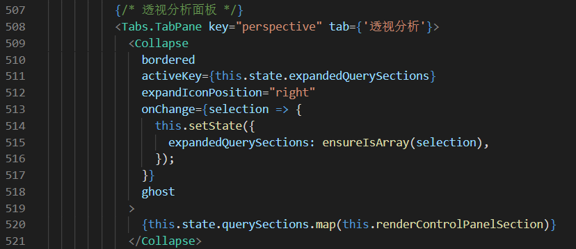
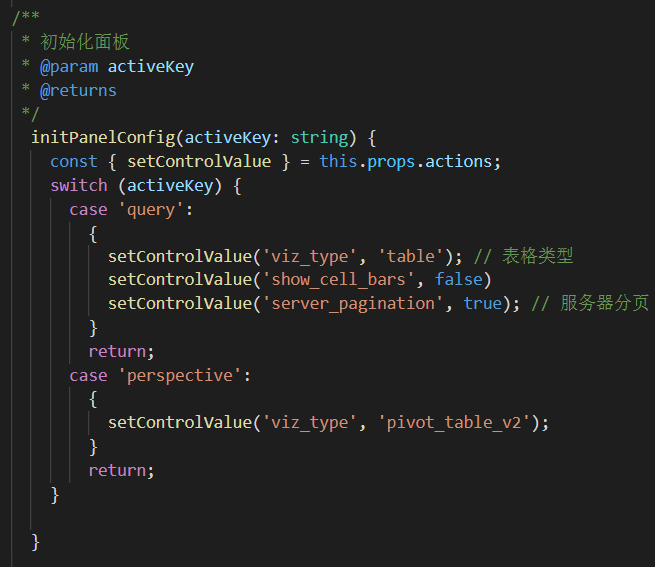

## 社保需求改动记录
### 导航栏改动
1. 图标改动
  + superset/config.py
    

2. 汉化以及简化菜单
   
  + superset-frontend/src/components/Menu/Menu.tsx
    A@O5.png)

3.设置隐藏

  + superset-frontend/src/components/Menu/MenuRight.tsx

    109~199注释

### 主题展示改造

1. 2.6.2.1.1导航栏删除

  + superset-frontend/src/views/menu.tsx

    

2. 2.6.2.1.2 替换主题列表
3. 2.6.2.1.3 保存按钮隐藏和定制化配置替换成透视面板

  + superset-frontend/src/explore/components/ExploreViewContainer.jsx

    584~593注释

  + superset-frontend/src/explore/components/ControlPanelsContainer.tsx

    

4. 2.6.2.1.4 图表类型隐藏，默认为表
5. 2.6.2.1.5 默认为“RAW RECORDS”,区域隐藏
6. 2.6.2.1.6 排序隐藏
7. 2.6.2.1.7 默认服务器分页，数据全部查询，不做最大限制。区域隐藏

  + superset-frontend/src/explore/components/ControlPanelsContainer.tsx

    

8. 2.6.2.1.9 移动执行保存按钮，隐藏多余按钮

  + superset-frontend/src/explore/components/ExploreViewContainer.jsx

    

+ superset-frontend/src/explore/components/ExploreActionButtons.tsx

  

  

9. 数据面板删除

+ superset-frontend/src/explore/components/ExploreChartPanel.jsx

  

10. 初始配置设置

+ superset-frontend/src/explore/components/ControlPanelsContainer.tsx

  

  

  

11. 透视表和明细表表格优化

+ 表头和单双行颜色

  superset-frontend/src/explore/components/Control.less

  ```less
  .chart-container {
    th {
      text-align: center !important;
      min-width: 167px !important;
    }
  
    td {
      text-align: left !important;
    }
  }
  
  @evenTrcolor :#D1DEEF;
  
  @tableColor: #d7d7f7;
  
  table.table-condensed {
    thead tr th {
      background-color: @tableColor;
  
    }
  
    tbody {
      tr:nth-child(even) {
        background-color: @evenTrcolor;
      }
    }
  }
  
  table.pvtTable thead tr th,
  table.pvtTable tbody tr th {
    border-top: 1px solid #ececec !important;
    border-left: 1px solid #ececec !important;
  }
  
  .pvtTable {
    thead {
      tr {
        th:first-child {
          background-color: @tableColor;
        }
      }
    }
  
    tbody {
      tr:nth-child(even) {
        .pvtVal {
          background-color: @evenTrcolor;
        }
      }
    }
  
    .pvtAxisLabel {
      background-color: @tableColor ;
    }
  
    .pvtRowLabel {
      background-color: @tableColor ;
    }
  
    .pvtTotalLabel {
      background-color: @tableColor ;
  
    }
  
    .pvtColLabel {
      background-color: @tableColor ;
  
    }
  }
  ```

  

### 主题菜单tabs页集成

1. 新增superset/web/views.py

   

2. 注册视图

   

3. 新增superset-frontend/src/web/index.tsx

   ```tsx
   import React, { useState, useEffect } from 'react';
   import ReactDOM from 'react-dom';
   import { Layout, Tabs } from 'antd';
   import rison from 'rison';
   import { SupersetClient } from '@superset-ui/core';
   import { BarChartOutlined } from '@ant-design/icons';
   import withToasts from 'src/components/MessageToasts/withToasts';
   import './index.less';
   
   const { Sider, Content } = Layout;
   const { TabPane } = Tabs;
   const tabsHeight = 40;
   //请求列表数据
   const createFetchDatasets = async (page: number = 0, pageSize: number = 25) => {
     // add filters if filterValue
     const queryParams = rison.encode({
       order_column: 'changed_on_delta_humanized',
       order_direction: 'desc',
       page,
       page_size: pageSize,
     });
   
     const { json = {} } = await SupersetClient.get({
       endpoint: `/api/v1/chart/?q=${queryParams}`,
     });
   
     return json?.result;
   };
   
   function Web() {
     const [menuLeft, setMenuLeft] = useState([]);
   
     const [iframeHeight, setIframeHeight] = useState(
       document.documentElement.clientHeight - tabsHeight,
     );
     const [chartsPanes, setChartsPanes] = useState<any>([]);
     const [activeChar, setActiveChar] = useState(chartsPanes[0]?.key);
     const initData = async () => {
       setMenuLeft(await createFetchDatasets());
     };
   
     useEffect(() => {
       initData();
     }, []);
   
     window.onresize = function () {
       setIframeHeight(document.documentElement.clientHeight - tabsHeight);
     };
   
     const handleSiderMenuClick = (charItem: any) => {
       setActiveChar(charItem.id);
       let isHave = false;
       chartsPanes.map((pane: any) => {
         if (charItem.id === pane.key) return (isHave = true);
       });
   
       if (!isHave) {
         setChartsPanes([
           ...chartsPanes,
           {
             title: charItem.slice_name,
             url: charItem.url,
             key: charItem.id,
           },
         ]);
       }
       sessionStorage.setItem('activeChar', charItem.id);
     };
     /**
      * 侧边导航
      * @param charItem
      * @returns
      */
     const siderMenuItem = (charItem: any) => {
       return (
         <div
           className={`sider-menu-item ${
             activeChar === charItem.id ? 'active' : null
           } `}
           onClick={handleSiderMenuClick.bind(this, charItem)}
         >
           <BarChartOutlined />
           <a>{charItem.slice_name}</a>
         </div>
       );
     };
     //处理tabs删除
     const handleTabsEdit = (targetKey: string, action: string) => {
       if (action === 'remove') {
         let lastIndex;
         let activeKey;
         chartsPanes.forEach((pane: any, i: number) => {
           if (String(pane.key) === targetKey) {
             lastIndex = i - 1;
           }
         });
         const panes = chartsPanes.filter(
           (pane: any) => pane.key !== Number(targetKey),
         );
         if (panes.length && String(activeChar) === targetKey) {
           if (lastIndex >= 0) {
             activeKey = panes[lastIndex].key;
           } else {
             activeKey = panes[0].key;
           }
         }
         setChartsPanes(panes);
         setActiveChar(activeKey);
       }
     };
     return (
       <Layout>
         <Sider theme="light" className="sider-menu">
           <div>
             {menuLeft.map((charItem: any) => {
               return siderMenuItem(charItem);
             })}
           </div>
         </Sider>
         <Content>
           <Tabs
             hideAdd
             onChange={activeKey => {
               setActiveChar(Number(activeKey));
             }}
             activeKey={String(activeChar)}
             onEdit={handleTabsEdit}
             type="editable-card"
           >
             {chartsPanes.map((pane: any) => (
               <TabPane tab={pane.title} key={pane.key}>
                 <div className="charts-container">
                   <iframe
                     scrolling="no"
                     frameBorder="0"
                     height={iframeHeight}
                     src={pane.url}
                   ></iframe>
                 </div>
               </TabPane>
             ))}
           </Tabs>
         </Content>
       </Layout>
     );
   }
   // export default withToasts(Web);
   ReactDOM.render(<Web />, document.getElementById('app'));
   ```

4. 新增superset-frontend/src/web/index.less

   ```less
   body {
     overflow: hidden;
   }
   
   
   .sider-menu {
     border-right: 2px solid #e2e2e2;
     display: flex;
     flex-direction: column;
   
     .sider-menu-item {
       width: 100%;
       height: 40px;
       padding-left: 10px;
       display: flex;
       align-items: center;
       justify-content: flex-start;
   
       &>a {
         color: rgba(0, 0, 0, 0.85);
         text-decoration: none;
         margin-left: 10px;
       }
   
     }
   
     .active {
       background-color: rgb(226, 226, 226);
     }
   }
   
   .ant-tabs-nav {
     margin: 0px !important;
   }
   
   
   .charts-container {
     height: 100%;
     width: 100%;
     min-height: 500px;
   }
   ```

### 行数限制修改

config.py


### superset-ui 依赖改动

1. node_modules/@superset-ui/react-pivottable/TableRenderers.js

   
